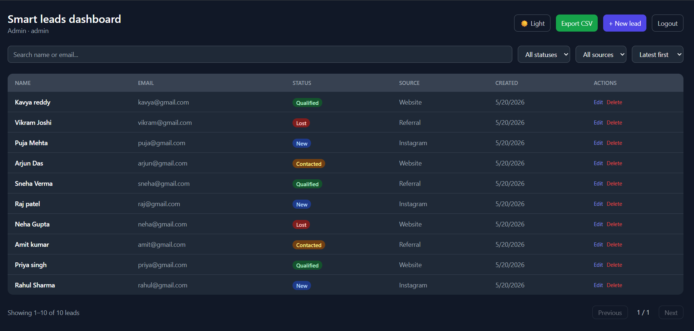

<div align="center">

# 🧩 Smart Leads Dashboard

### Full-Stack CRM · Lead Management System

[](https://typescriptlang.org/)
[](https://reactjs.org/)
[](https://nodejs.org/)
[](https://mongodb.com/)
[](https://expressjs.com/)
[](https://docker.com/)
[](https://smart-leads-dashboard-navy.vercel.app/)

<br/>

**[🔗 Live Demo](https://smart-leads-dashboard-navy.vercel.app/) · [📂 Repository](https://github.com/Piyushratn/smart-leads-dashboard) · [🐛 Report Bug](https://github.com/Piyushratn/smart-leads-dashboard/issues) · [✨ Request Feature](https://github.com/Piyushratn/smart-leads-dashboard/issues)**

</div>

---

## 📌 The Problem

> Sales teams waste hours managing leads across spreadsheets, with no role-based visibility, no search, no filtering, and no audit trail. Admins can't control what sales reps can delete. Data leaks through CSV exports without access control.

**Smart Leads Dashboard solves this** — a production-grade CRM with JWT auth, role-based permissions, debounced search, paginated APIs, and one-click CSV export. Built entirely in TypeScript across the full stack.

---

## 📊 Stats

<div align="center">

| 🔷 TypeScript Coverage | 🔐 Auth System | 📄 Records Per Page | ⚡ Search Debounce | 🐳 Containerized |
|:---:|:---:|:---:|:---:|:---:|
| **94.1%** | **JWT + RBAC** | **10 (paginated)** | **400ms** | **Docker Compose** |

</div>

---

## ✨ Features

| Feature | Description |
|---------|-------------|
| 🔐 **JWT Authentication** | Secure register/login with token-based sessions |
| 👥 **Role-Based Access Control** | Admin sees all leads; Sales sees own leads only |
| 🗂️ **Full Lead CRUD** | Create, Read, Update, Delete with validation |
| 🔍 **Debounced Search** | Search by name or email — 400ms debounce, no API spam |
| 🎛️ **Advanced Filtering** | Filter by Status (New/Contacted/Qualified/Lost) and Source |
| 📑 **Backend Pagination** | 10 records per page, server-side — scales with data size |
| 📤 **CSV Export** | One-click export of filtered leads data |
| 🌙 **Dark Mode** | Full dark/light theme support |
| 📱 **Responsive Design** | Works on desktop, tablet, and mobile |
| 🐳 **Docker Support** | Full `docker-compose` setup — one command to run everything |

---

## 🖼️ Screenshots

> **Dashboard — Lead Management View**



> *(Add screenshots: login page, admin view, sales view, filters in action)*

---

## 🏗️ System Architecture

```
┌─────────────────────────────────────────────────────────────────┐
│                        FRONTEND (React + TS)                     │
│              TailwindCSS · React Router · Axios                  │
│    [ Login ] [ Register ] [ Dashboard ] [ Lead Form ] [ CSV ]    │
└────────────────────────┬────────────────────────────────────────┘
                         │ HTTP Requests (Axios + JWT Header)
                         ▼
┌─────────────────────────────────────────────────────────────────┐
│                    EXPRESS API (Node.js + TS)                    │
│                                                                  │
│   /api/auth/register   /api/auth/login   /api/auth/me           │
│   /api/leads           /api/leads/:id    /api/leads/export/csv  │
└──────────┬──────────────────────┬───────────────────────────────┘
           │                      │
           ▼                      ▼
┌─────────────────┐    ┌──────────────────────────────────────────┐
│  AUTH MIDDLEWARE │    │           ROLE MIDDLEWARE                 │
│  Verify JWT      │    │  Admin → all leads                       │
│  Attach user     │    │  Sales → own leads only                  │
│  to request      │    │  Delete → Admin only                     │
└────────┬────────┘    └──────────────────┬───────────────────────┘
         │                                │
         └──────────────┬─────────────────┘
                        │
                        ▼
┌─────────────────────────────────────────────────────────────────┐
│                CONTROLLERS (TypeScript)                          │
│   auth.controller.ts        lead.controller.ts                  │
│   • register / login        • CRUD operations                   │
│   • bcrypt hashing          • Filter + Search + Sort            │
│   • JWT signing             • Pagination logic                  │
│                             • CSV generation                    │
└──────────────────────────┬──────────────────────────────────────┘
                           │ Mongoose ODM
                           ▼
┌─────────────────────────────────────────────────────────────────┐
│                     MONGODB DATABASE                             │
│              Users Collection · Leads Collection                │
│         Mongoose Models with TypeScript interfaces              │
└─────────────────────────────────────────────────────────────────┘
```

---

## 🛠️ Tech Stack

### Frontend


### Backend


### Database


### Infrastructure


---

## 📁 Project Structure

```
smart-leads-dashboard/
├── backend/
│   ├── src/
│   │   ├── config/
│   │   │   └── db.ts              # MongoDB connection
│   │   ├── controllers/
│   │   │   ├── auth.controller.ts # Register, login, me
│   │   │   └── lead.controller.ts # CRUD, filters, pagination, CSV
│   │   ├── middleware/
│   │   │   ├── auth.ts            # JWT verification
│   │   │   ├── role.ts            # RBAC (Admin / Sales)
│   │   │   └── errorHandler.ts    # Global error handler
│   │   ├── models/
│   │   │   ├── User.ts            # User schema + types
│   │   │   └── Lead.ts            # Lead schema + types
│   │   ├── routes/
│   │   │   ├── auth.routes.ts     # Auth endpoints
│   │   │   └── lead.routes.ts     # Lead endpoints
│   │   ├── types/
│   │   │   └── index.ts           # Shared TypeScript types
│   │   └── app.ts                 # Express app entry
│   ├── .env.example
│   ├── Dockerfile
│   └── package.json
├── frontend/
│   ├── src/
│   │   ├── api/
│   │   │   ├── axios.ts           # Axios instance + interceptors
│   │   │   ├── auth.api.ts        # Auth API calls
│   │   │   └── leads.api.ts       # Leads API calls
│   │   ├── components/
│   │   │   ├── Filters.tsx        # Status + Source filters
│   │   │   ├── LeadForm.tsx       # Create/Edit lead form
│   │   │   └── Pagination.tsx     # Page navigation
│   │   ├── context/
│   │   │   └── AuthContext.tsx    # Global auth state
│   │   ├── hooks/
│   │   │   ├── useLeads.ts        # Lead data fetching hook
│   │   │   └── useDebounce.ts     # 400ms debounce hook
│   │   ├── pages/
│   │   │   ├── Login.tsx
│   │   │   ├── Register.tsx
│   │   │   └── Dashboard.tsx
│   │   ├── types/
│   │   │   └── index.ts           # Shared frontend types
│   │   └── App.tsx
│   └── package.json
├── docker-compose.yml
└── README.md
```

---

## ⚙️ Setup & Installation

### Prerequisites
- Node.js v18+
- MongoDB (local or [MongoDB Atlas](https://cloud.mongodb.com) free tier)
- Docker (optional)

### Option A — Without Docker

**Backend:**
```bash
cd backend
cp .env.example .env
# Fill in your .env values (see Environment Variables below)
npm install
npm run dev
```

**Frontend (separate terminal):**
```bash
cd frontend
npm install
npm start
```

### Option B — With Docker (recommended)

```bash
# From the root of the project
docker-compose up --build
```

That's it — MongoDB, backend, and frontend all start together.

---

## 🔑 Environment Variables

Create `backend/.env` using the example file:

```env
PORT=5000
MONGO_URI=mongodb://127.0.0.1:27017/smart-leads
JWT_SECRET=your_strong_jwt_secret_here
JWT_EXPIRES_IN=7d
NODE_ENV=development
CLIENT_URL=http://localhost:3000
```

> **Never commit `.env` to Git.** It's already in `.gitignore`.

---

## 📡 API Documentation

### Auth Routes

| Method | Endpoint | Description |
|--------|----------|-------------|
| `POST` | `/api/auth/register` | Register new user |
| `POST` | `/api/auth/login` | Login — returns JWT |
| `GET` | `/api/auth/me` | Get current user (Protected) |

### Lead Routes (All Protected — JWT required)

| Method | Endpoint | Role | Description |
|--------|----------|------|-------------|
| `GET` | `/api/leads` | All | Get leads with filters + pagination |
| `GET` | `/api/leads/:id` | All | Get single lead |
| `POST` | `/api/leads` | All | Create new lead |
| `PATCH` | `/api/leads/:id` | All | Update lead |
| `DELETE` | `/api/leads/:id` | **Admin only** | Delete lead |
| `GET` | `/api/leads/export/csv` | All | Export filtered leads as CSV |

### Query Parameters for `GET /api/leads`

| Parameter | Type | Description |
|-----------|------|-------------|
| `status` | string | `New` / `Contacted` / `Qualified` / `Lost` |
| `source` | string | `Website` / `Instagram` / `Referral` |
| `search` | string | Search by name or email |
| `sort` | string | `latest` / `oldest` |
| `page` | number | Page number (default: `1`) |
| `limit` | number | Records per page (default: `10`) |

---

## 👥 Role-Based Access Control

| Feature | Admin | Sales |
|---------|-------|-------|
| View leads | ✅ All leads | ✅ Own leads only |
| Create lead | ✅ | ✅ |
| Edit lead | ✅ | ✅ |
| Delete lead | ✅ | ❌ |
| Export CSV | ✅ | ✅ |

---

## 🔐 Security

- Passwords hashed with **bcryptjs** (10 salt rounds) — never stored in plain text
- **JWT tokens** signed with secret key — validated on every protected route
- **Role middleware** runs after auth middleware — two-layer protection
- `.env` excluded from Git via `.gitignore`
- Mongoose ODM prevents NoSQL injection by design

---

## 🚀 Key Engineering Highlights

- **94% TypeScript** — full type safety across frontend and backend, shared type definitions in `types/index.ts`
- **Custom `useDebounce` hook** — prevents API spam during search, fires request only after 400ms of inactivity
- **Server-side pagination** — `skip` + `limit` in MongoDB queries, not client-side filtering
- **RBAC middleware chain** — `auth.ts` verifies JWT and attaches user, `role.ts` checks permissions — clean separation of concerns
- **Docker Compose orchestration** — single command starts MongoDB + backend + frontend with correct networking
- **Conventional commits** — `feat:`, `fix:`, `refactor:`, `docs:` — traceable, professional git history

---

## 🗺️ Roadmap

- [ ] Email notifications when lead status changes
- [ ] Lead activity timeline / audit log
- [ ] Dashboard analytics (charts — leads by source, conversion rate)
- [ ] Bulk lead import via CSV upload
- [ ] Two-factor authentication (2FA)

---

## 👨‍💻 Author

**Piyush Ratn** — AI-Focused Full-Stack Developer

[](https://linkedin.com/in/piyush-ratn)
[](https://github.com/Piyushratn)
[](mailto:piyushratn932@gmail.com)
[](https://github.com/Piyushratn)

---

## 📄 License

This project is open source and available under the [MIT License](LICENSE).

---

<div align="center">

⭐ **If this project helped you, consider giving it a star!** ⭐

*Built with ❤️ by [Piyush Ratn](https://github.com/Piyushratn)*

</div>
